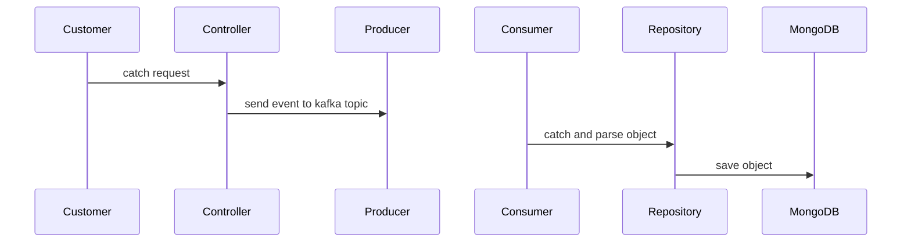

# Kafka Listener Proof of Concept (PoC)
## _Read of event and save it_

## Objective
  This exercise aims to address a common need for streaming consumer events by utilizing a simple set of open-source products and technologies. It provides functionality and solves a problem in a straightforward manner.

## Requirements
 Next, I will list the technologies used in the PoC. I utilized Windows 10 as the operating system.
 - Java 8
 - Maven 3.8.5
 - Spring Boot 
 - Kafka & Zookeeper
 - Mongo
 - Docker 24.0.2

## Sequence diagram


## Steps to run application
 - Download from repository the project
    ```sh
    git clone blablabla
    ```
    chage to the folder kafkalistener
    
 - Compile Java application
    ```sh
    mvn clean package -DskipTests
    ```
 - Create a kafkalistener image
    ```sh
    docker build -t pocvultposting .
    ## validate exist the docker image
    docker imgages
    ## you will see the pocvultposting image
    ```
 - Ceate rest of images with docker compose
    ```sh
    docker compose up -d
    ## could you validate a state of pocvultposting containers and see the logs if you use the next commands 
    docker logs --follow -name pocvultpostingserver
    ## you will see the pocvultposting image
    ```
 - Test the application from rest client
   ```sh
   localhost:8080/publish?message=helloworld
   ```    
 - Delete all containers
   ```sh
   ## Stop all container of docker compose file 
    docker compose down
   ## Delete all container unused    
    docker system prune -a
    ```
